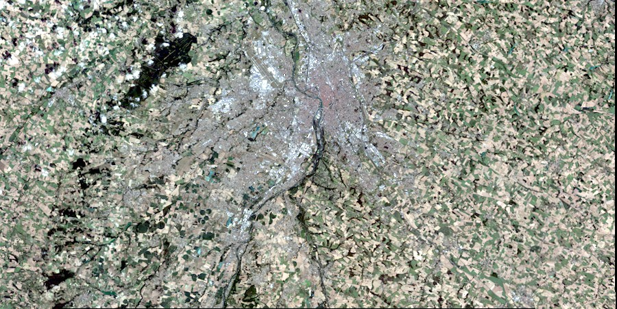

# Search API documentation

## Open API

The Open API specification can be [downloaded](../search.yaml) or [consulted](http://airbusgeo.github.io/geoapi-viewer/?url=https://airbusgeo.github.io/api-docs/search.yaml) directly in Airbus API Viewer.

## Prerequisites

In order to use the Search API you need first to obtain an API key by requesting it to the customer care support or the [Contact Us](http://www.intelligence-airbusds.com/contact/) page.

## Usage examples

### Search and image and retrieve its identifier

This example demonstrate how to find a SPOT image and extract its identifier to be able to order it through the [Order API](../order.md).

First, define your API key so that the example commands can use it:

```shell
export MY_API_KEY=***INSERT YOUR API KEY HERE***
```

You can now request the desired images using a POST search request. Here we request all images that:
- are in the bounding box 1.18, 43.52, 1.25, 43.56 expressed in geographic coordinates
- are of type optical
- were acquired with one of the satellite of the SPOT constellation (i.e. SPOT 1 to 6)
- were acquired in July 2016
- have an incidence angle less or equal to 20 degrees
- have less than 10 percent of it covered by clouds

```shell
curl -X POST -H "Authorization: APIKEY $MY_API_KEY" -H "Content-Type: application/json" -d '{
  "bbox": [
    1.18,
    43.52,
    1.25,
    43.56
  ],
  "sensorType": "optical",
  "constellation": [
    "SPOT"
  ],
  "acquisitionDate": "[2016-07-01,2016-07-31T23:59:59]",
  "incidenceAngle": "20]",
  "cloudCover": "10]",
  "count": 10,
  "startPage": 1
}' "https://search.geoapi-airbusds.com/api/v1/search"
```

The response should look like:

```json
{
   "totalResults" : 1,
   "itemsPerPage" : 10,
   "type" : "FeatureCollection",
   "features" : [
      {
         "properties" : {
            "sourceId" : "DS_SPOT7_201607291038129_FR1_FR1_FR1_FR1_E001N44_01140",
            "satellite" : "SPOT7",
            "productName" : "SPOT 1.5-m",
            "provider" : "Airbus Defence and Space",
            "cloudCover" : 1,
            "incidenceAngle" : 19.9324257673857,
            "constellation" : "SPOT",
            "acquisitionDate" : "2016-07-29T10:38:18.749Z",
            "resolution" : 1.5,
            "viewingAngleAcrossTrack" : 17.909748,
            "viewingAngleAlongTrack" : 17.842472
         },
         "id" : "ea1575c9-a4e5-4748-9e1b-fbc37d7286e9::5f08c566-0c5e-4baf-bf66-05d6c530aaf5",
         "thumbnail" : "https://search.geoapi-airbusds.com/api/v1/productTypes/SPOT_1_5/products/DS_SPOT7_201607291038129_FR1_FR1_FR1_FR1_E001N44_01140?size=SMALL",
         "geometry" : {
            "coordinates" : [
               [
                  [
                     1.00409636794572,
                     43.7046518627418
                  ],
                  [
                     1.83963153029114,
                     43.6915345718161
                  ],
                  [
                     1.84076579791152,
                     43.3869345568225
                  ],
                  [
                     1.0028176461841,
                     43.4014298007982
                  ],
                  [
                     1.00409636794572,
                     43.7046518627418
                  ]
               ]
            ],
            "type" : "Polygon"
         },
         "bbox" : [
            1.0028176461841,
            43.3869345568225,
            1.84076579791152,
            43.7046518627418
         ],
         "quickLooks" : [
            {
               "size" : "SMALL",
               "projection" : null,
               "image" : "https://search.geoapi-airbusds.com/api/v1/productTypes/SPOT_1_5/products/DS_SPOT7_201607291038129_FR1_FR1_FR1_FR1_E001N44_01140?size=SMALL"
            },
            {
               "projection" : null,
               "image" : "https://search.geoapi-airbusds.com/api/v1/productTypes/SPOT_1_5/products/DS_SPOT7_201607291038129_FR1_FR1_FR1_FR1_E001N44_01140?size=MEDIUM",
               "size" : "MEDIUM"
            },
            {
               "projection" : "http://www.opengis.net/def/crs/EPSG/0/4326",
               "image" : "https://search.geoapi-airbusds.com/api/v1/productTypes/SPOT_1_5/products/DS_SPOT7_201607291038129_FR1_FR1_FR1_FR1_E001N44_01140?projection=EPSG:4326&size=MEDIUM",
               "size" : "MEDIUM"
            },
            {
               "size" : "LARGE",
               "image" : "https://search.geoapi-airbusds.com/api/v1/productTypes/SPOT_1_5/products/DS_SPOT7_201607291038129_FR1_FR1_FR1_FR1_E001N44_01140?size=LARGE",
               "projection" : null
            },
            {
               "projection" : "http://www.opengis.net/def/crs/EPSG/0/3857",
               "image" : "https://search.geoapi-airbusds.com/api/v1/productTypes/SPOT_1_5/products/DS_SPOT7_201607291038129_FR1_FR1_FR1_FR1_E001N44_01140?projection=EPSG:3857&size=MEDIUM",
               "size" : "MEDIUM"
            }
         ],
         "type" : "Feature"
      }
   ],
   "startIndex" : 1,
   "query" : {
      "cloudCover" : "10]",
      "incidenceAngle" : "20]",
      "acquisitionDate" : "[2016-07-01,2016-07-31T23:59:59]",
      "constellation" : [
         "SPOT"
      ],
      "count" : 10,
      "sensorType" : "optical",
      "bbox" : [
         1.18,
         43.52,
         1.25,
         43.56
      ],
      "startPage" : 1
   }
}
```

To verify that the image is of the desired quality, you can request a quicklook of it. Here we choose to check the LARGE and unprojected quicklook:

```shell
curl -X GET -H "Authorization: APIKEY $MY_API_KEY" "https://search.geoapi-airbusds.com/api/v1/productTypes/SPOT_1_5/products/DS_SPOT7_201607291038129_FR1_FR1_FR1_FR1_E001N44_01140?size=LARGE"
```

The quicklook should look like the following image:




