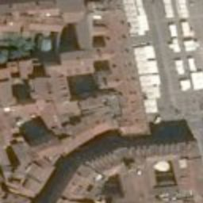
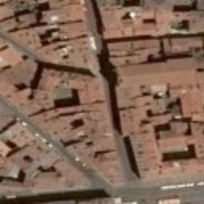

# View API documentation

## Open API

The Open API specification can be [downloaded](../view.yaml) or [consulted](http://airbusgeo.github.io/geoapi-viewer/?url=https://airbusgeo.github.io/api-docs/view.yaml) directly in Airbus API Viewer.

## Prerequisites

In order to use the View API you need first to obtain an API key by requesting it to the customer care support or the [Contact Us](http://www.intelligence-airbusds.com/contact/) page.

## Usage examples

This example demonstrates how to access the view layers and individual images to display them in a web or mobile application. We use _Toulouse Capitol_ square as the location (lon=1.4436936378479004,lat=43.60455930233002).


### Authentication

First, define your API key so that the example commands can use it:

```shell
export MY_API_KEY=***INSERT YOUR API KEY HERE***
```

### Access to layers

In order to access the View API layers, you must first retrieve the layers identifiers. The ```/me``` endpoint lists all the layers you can access: 

```shell
curl -X GET -H "Authorization: $MY_API_KEY" "https://view.geoapi-airbusds.com/api/v1/me"
```

The response should look like:

```json
{
  "canCompose": true,
  "email": "john.doe@airbus.com",
  "externalId": "7743610706",
  "firstname": "John",
  "id": "4f586b1f-9999-4ba6-8188-8afdf2684126",
  "isSubscriptionSuspended": false,
  "lastname": "Doe",
  "maps": {
    "compositions": [],
    "imagery": {
      "id": "CF69E122-9999-11E6-B6B4-3F1489348498",
      "layers": [
        {
          "id": "53744984-9999-11E7-80B3-420189964461",
          "offerName": "OneLive"
        }
      ],
      "links": {
        "ags": "https://view.geoapi-airbusds.com/api/v1/map/imagery.ags/services",
        "agsRestDirect": "https://view.geoapi-airbusds.com/mugg/rest/services/CF69E122-9999-11E6-B6B4-3F1489348498/MapServer",
        "agsSoapDirect": "https://view.geoapi-airbusds.com/mugg/soap/CF69E122-9999-11E6-B6B4-3F1489348498/services",
        "kml": "https://view.geoapi-airbusds.com/api/v1/map/imagery.kml",
        "kmlDirect": "https://view.geoapi-airbusds.com/mugg/kml/CF69E122-9999-11E6-B6B4-3F1489348498",
        "wms": "https://view.geoapi-airbusds.com/api/v1/map/imagery.wms",
        "wmsDirect": "https://view.geoapi-airbusds.com/mugg/wms/CF69E122-9999-11E6-B6B4-3F1489348498?",
        "wmts": "https://view.geoapi-airbusds.com/api/v1/map/imagery.wmts",
        "wmtsDirect": "https://view.geoapi-airbusds.com/mugg/wmts/CF69E122-9999-11E6-B6B4-3F1489348498?"
      }
    },
    "metadata": {
      "id": "CF11E595-9999-11E6-B6B3-0F918242EB09",
      "layers": [
        {
          "id": "59945568-9999-11E7-80B3-424854475111",
          "offerName": "OneLive-Metadata"
        }
      ],
      "links": {
        "ags": "https://view.geoapi-airbusds.com/api/v1/map/imagery-composition-detail.ags/services",
        "agsRestDirect": "https://view.geoapi-airbusds.com/mugg/rest/services/CF11E595-9999-11E6-B6B3-0F918242EB09/MapServer",
        "agsSoapDirect": "https://view.geoapi-airbusds.com/mugg/soap/CF11E595-9999-11E6-B6B3-0F918242EB09/services",
        "kml": "https://view.geoapi-airbusds.com/api/v1/map/imagery-composition-detail.kml",
        "kmlDirect": "https://view.geoapi-airbusds.com/mugg/kml/CF11E595-9999-11E6-B6B3-0F918242EB09",
        "wfs": "https://view.geoapi-airbusds.com/api/v1/map/imagery-composition-detail.wfs",
        "wfsDirect": "https://view.geoapi-airbusds.com/mugg/wfs/885964C9-9999-4DB5-815D-48A01941BF0D?",
        "wms": "https://view.geoapi-airbusds.com/api/v1/map/imagery-composition-detail.wms",
        "wmsDirect": "https://view.geoapi-airbusds.com/mugg/wms/CF11E595-9999-11E6-B6B3-0F918242EB09?",
        "wmts": "https://view.geoapi-airbusds.com/api/v1/map/imagery-composition-detail.wmts",
        "wmtsDirect": "https://view.geoapi-airbusds.com/mugg/wmts/CF11E595-9999-11E6-B6B3-0F918242EB09?"
      }
    }
  },
  "subscriptionAdministrator": [],
  "subscriptions": [
    "119934e0-9999-442c-8a14-fae18754458d"
  ],
  "systemRoles": [],
  "userPreference": {}
}
```

The available layers can be found under the ```/maps/imagery/layers``` path. Depending on the offers you have subscribed to, you can see one to many layers. In our Example, the user has subscribed to the ```OneLive``` layer with the identifier ```53744984-9999-11E7-80B3-420189964461```. This identifier is user specific and must be retrieved from the previous request.

```json
{
  ...
  "maps": {
    ...
    "imagery": {
      "id": "...",
      "layers": [
        {
          "id": "53744984-9999-11E7-80B3-420189964461",
          "offerName": "OneLive"
        }
      ]
  ...
}
```


Set your own identifier using the command below. 
```shell
export MY_LAYER_ID=***INSERT YOUR LAYER IDENTIFIER HERE***
```

Following the WMTS specification, you can then request the tiles you need by converting your coordinates in tile column and row :

```shell
curl -X GET -H "Authorization: $MY_API_KEY" "https://view.geoapi-airbusds.com/api/v1/map/imagery.wmts?layer=$MY_LAYER_ID&tilematrixset=4326&Service=WMTS&Request=GetTile&Version=1.0.0&Format=image/png&TileMatrix=17&TileCol=132122&TileRow=33783"

curl -X GET -H "Authorization: $MY_API_KEY" "https://view.geoapi-airbusds.com/api/v1/map/imagery.wmts?layer=$MY_LAYER_ID&tilematrixset=4326&Service=WMTS&Request=GetTile&Version=1.0.0&Format=image/png&TileMatrix=17&TileCol=132123&TileRow=33783"

curl -X GET -H "Authorization: $MY_API_KEY" "https://view.geoapi-airbusds.com/api/v1/map/imagery.wmts?layer=$MY_LAYER_ID&tilematrixset=4326&Service=WMTS&Request=GetTile&Version=1.0.0&Format=image/png&TileMatrix=17&TileCol=132122&TileRow=33784"

curl -X GET -H "Authorization: $MY_API_KEY" "https://view.geoapi-airbusds.com/api/v1/map/imagery.wmts?layer=$MY_LAYER_ID&tilematrixset=4326&Service=WMTS&Request=GetTile&Version=1.0.0&Format=image/png&TileMatrix=17&TileCol=132123&TileRow=33784"
```

The 4 requested tiles should display Toulouse Capitol:


<table style="border:1;">
  <tr style="padding:0px;">
    <td style="padding:0px;"></td>
    <td style="padding:0px;"></td>
  </tr>
  <tr style="padding:0px;">
    <td style="padding:0px;"></td>
    <td style="padding:0px;"></td>
  </tr>
</table>

### Access to individual images

If the view returned by the layer does no match you expectations, you can access each individual images which are part of your subscription (One Live, One View, ....) that are available at the same location. In our example, we don't like the stands that are on _Toulouse Capitol_ square and would like to see if another image if free of them.

#### Request the available image list

We start by requesting which images are available and cover _Toulouse Capitol_. 

```
curl -X GET \
  -H "Authorization: $MY_API_KEY" \
  'https://view.geoapi-airbusds.com/api/v1/images?bbox=1.4409403502941132,43.60221371054649,1.445687860250473,43.60654279589653&size=999999'
```

The bbox parameter list the geographic coordinates of the bounding box the requeted images should intersect with.


```
{
  "size": 5000,
  "totalResults": 7,
  "sort": [
    {
      "direction": "DESC",
      "property": "acquisitionDate"
    }
  ],
  "query": {
    "geometry": "POLYGON ((1.4456878602504730 43.6022137105464935, 1.4409403502941132 43.6022137105464935, 1.4409403502941132 43.6065427958965302, 1.4456878602504730 43.6065427958965302, 1.4456878602504730 43.6022137105464935))",
    "pw": "1",
    "sortKeys": "constellation,1 acquisitionDate,0",
    "xuid": "exists()",
    "count": "999999"
  },
  "features": [
    {
      "geometry": {
        "coordinates": [
          [
            [
              1.346182870370385,
              43.73616898148147
            ],
            [
              1.345997685185185,
              43.542409722206706
            ],
            [
              1.602974537057595,
              43.53290972220595
            ],
            [
              1.605854166687455,
              43.5326550925763
            ],
            [
              1.609743055576655,
              43.5326550925763
            ],
            [
              1.609812500021105,
              43.727585648147446
            ],
            [
              1.577974537055595,
              43.729090277777196
            ],
            [
              1.461178240749955,
              43.73327083333309
            ],
            [
              1.346182870370385,
              43.73616898148147
            ]
          ]
        ],
        "type": "Polygon"
      },
      "properties": {
        "bbox": [
          1.3459976851851851,
          43.5326550925763,
          1.6098125000211052,
          43.73616898148147
        ],
        "satellite": "Pleiades 1B",
        "incidenceAngle": 18.31938405120725,
        "vehicle": "Pleiades 1B",
        "acquisitionDate": "2016-09-06T11:04:08.800000+00:00",
        "constellation": "Pleiades",
        "cloudCover": 0,
        "wmtsUrl": "https://view.geoapi-airbusds.com/api/v1/map/preview/8ad3a1245ca717c185faae21426813c067f6a39d/{z}/{y}/{x}",
        "illuminationElevationAngle": 51.25356690105058,
        "viewingAngle": null,
        "resolution": 0.5,
        "insertionDate": "2016-09-15T22:23:16.989000+00:00"
      },
      "type": "Feature",
      "id": "8ad3a1245ca717c185faae21426813c067f6a39d"
    },
    {
      "geometry": {
        "coordinates": [
          [
            [
              1.538192129648928,
              43.68129398148148
            ],
            [
              1.296956018518518,
              43.68112268518517
            ],
            [
              1.297215277777798,
              43.61749768518008
            ],
            [
              1.297270833333358,
              43.52466435183932
            ],
            [
              1.415789351861358,
              43.52466435183932
            ],
            [
              1.415789351861358,
              43.52489583332082
            ],
            [
              1.415803240750248,
              43.52466435183932
            ],
            [
              1.419034722231988,
              43.52466435183932
            ],
            [
              1.419030092602358,
              43.52485416665415
            ],
            [
              1.419053240750508,
              43.52466435183932
            ],
            [
              1.419127314824588,
              43.52480324072822
            ],
            [
              1.419173611120888,
              43.52466435183932
            ],
            [
              1.420909722232138,
              43.52466435183932
            ],
            [
              1.421006944454368,
              43.52482175924674
            ],
            [
              1.421016203713628,
              43.52466435183932
            ],
            [
              1.421243055565498,
              43.52466435183932
            ],
            [
              1.421358796306248,
              43.52486805554304
            ],
            [
              1.421368055565508,
              43.52466435183932
            ],
            [
              1.422747685195248,
              43.52466435183932
            ],
            [
              1.422793981491548,
              43.52485416665415
            ],
            [
              1.422812500010068,
              43.52466435183932
            ],
            [
              1.423905092602748,
              43.52478935183933
            ],
            [
              1.423932870380528,
              43.52466435183932
            ],
            [
              1.433576388899818,
              43.52466435183932
            ],
            [
              1.433530092603518,
              43.52485879628378
            ],
            [
              1.433590277788708,
              43.52466435183932
            ],
            [
              1.436951388900088,
              43.52466435183932
            ],
            [
              1.436974537048238,
              43.52484953702452
            ],
            [
              1.436979166677868,
              43.52466435183932
            ],
            [
              1.543983796316058,
              43.52466435183932
            ],
            [
              1.544266203723488,
              43.68129398148148
            ],
            [
              1.538192129648928,
              43.68129398148148
            ]
          ]
        ],
        "type": "Polygon"
      },
      "properties": {
        "bbox": [
          1.296956018518518,
          43.52466435183932,
          1.544266203723488,
          43.68129398148148
        ],
        "satellite": "Pleiades 1A",
        "incidenceAngle": 2.484316523760774,
        "vehicle": "Pleiades 1A",
        "acquisitionDate": "2016-07-17T10:56:52.600000+00:00",
        "constellation": "Pleiades",
        "cloudCover": 0,
        "wmtsUrl": "https://view.geoapi-airbusds.com/api/v1/map/preview/144972e5b2e6ca1871dd90c1a8c9770553c9627e/{z}/{y}/{x}",
        "illuminationElevationAngle": 63.93174448717541,
        "viewingAngle": null,
        "resolution": 0.5,
        "insertionDate": "2016-09-09T19:39:33.948000+00:00"
      },
      "type": "Feature",
      "id": "144972e5b2e6ca1871dd90c1a8c9770553c9627e"
    },
    ...
  ]
}
```

One Atlas layers are built using images by ordering them first by constellation (Pléiades then SPOT) and for each constellation by acquisition date. In the returned images list, the first image is the one used for the layer. For the example, we will see if the second Pléiades image contains stand.

To access the image tiles we can use the _wmtsUrl_ property : ```https://view.geoapi-airbusds.com/api/v1/map/preview/144972e5b2e6ca1871dd90c1a8c9770553c9627e/{z}/{y}/{x}``` and replace the z, y, x parameters by the wmts indexes :

```
# Top Left
curl -X GET \
  -H "Authorization: $MY_API_KEY" \
  https://view.geoapi-airbusds.com/api/v1/map/preview/144972e5b2e6ca1871dd90c1a8c9770553c9627e/17/33783/132122

# Top Right
curl -X GET \
  -H "Authorization: $MY_API_KEY" \
  https://view.geoapi-airbusds.com/api/v1/map/preview/144972e5b2e6ca1871dd90c1a8c9770553c9627e/17/33783/132123

# Bottom Left
curl -X GET \
  -H "Authorization: $MY_API_KEY" \
  https://view.geoapi-airbusds.com/api/v1/map/preview/144972e5b2e6ca1871dd90c1a8c9770553c9627e/17/33784/132122

# Bottom Right
curl -X GET \
  -H "Authorization: $MY_API_KEY" \
  https://view.geoapi-airbusds.com/api/v1/map/preview/144972e5b2e6ca1871dd90c1a8c9770553c9627e/17/33784/132123
```

<table style="border:1;">
  <tr style="padding:0px;">
    <td style="padding:0px;"></td>
    <td style="padding:0px;"></td>
  </tr>
  <tr style="padding:0px;">
    <td style="padding:0px;"></td>
    <td style="padding:0px;"></td>
  </tr>
</table>


